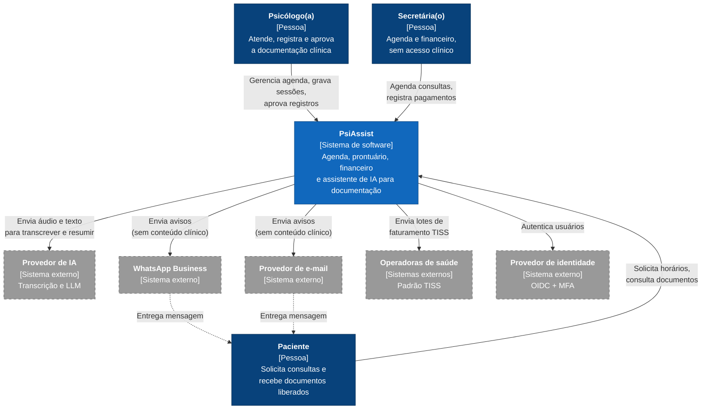
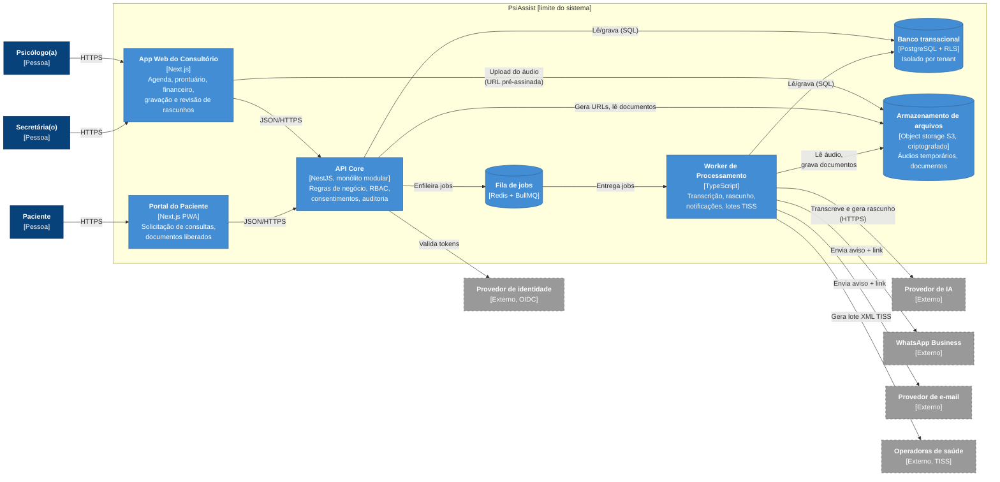
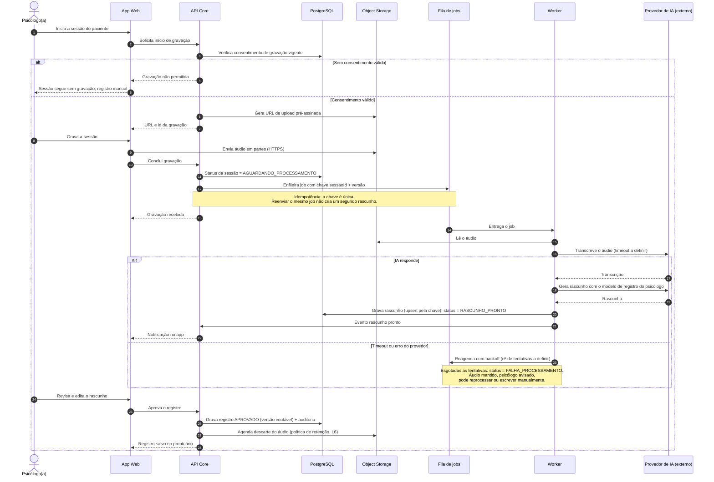
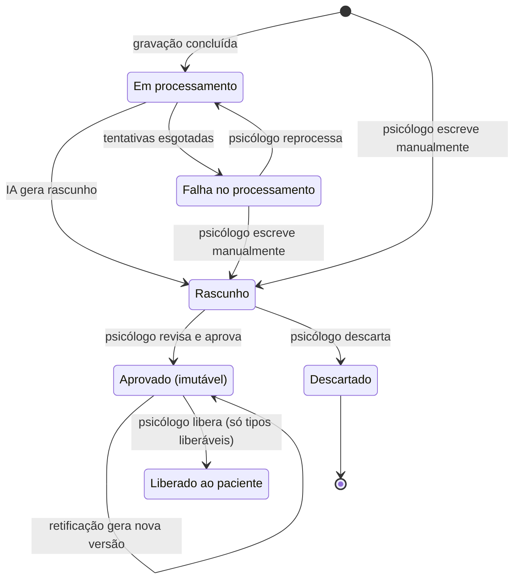

# PsiAssist: documentação de discovery

Assistente pessoal para psicólogos clínicos: agenda, prontuário, controle financeiro e um assistente de IA que transforma a gravação da consulta em rascunho de registro clínico.

> **Status:** fase de *discovery*. Nada foi implementado. Este repositório reúne a descrição do sistema, os diagramas em código (Mermaid) e as decisões tomadas até aqui. A ideia é que ele sirva de contexto para agentes de desenvolvimento implementarem o sistema seguindo a arquitetura documentada. Veja [AGENTS.md](AGENTS.md).

**Como ler este documento.** Cada afirmação importante está marcada com a sua origem:

| Marca | Significado |
|-------|-------------|
| **[F]** | Fato: informado pelo dono do produto. |
| **[S]** | Sugestão ou suposição de trabalho: proposta na modelagem, ainda precisa ser validada. |
| **[L]** | Lacuna: não foi decidida e não deve ser inventada (lista na [seção 1.8](#18-lacunas)). |

---

## Sumário

1. [Descrição do sistema](#1-descrição-do-sistema)
2. [Diagramas](#2-diagramas)
3. [Decisões e ajustes sobre o que o modelo gerou](#3-decisões-e-ajustes-sobre-o-que-o-modelo-gerou)
4. [O que falta para um agente construir sem inventar decisões](#4-o-que-falta-para-um-agente-construir-sem-inventar-decisões)
5. [Próximos passos](#5-próximos-passos)

---

## 1. Descrição do sistema

### 1.1 Problema e propósito

Psicólogos clínicos que atendem em consultório próprio dividem o tempo entre o atendimento e tarefas administrativas: marcar e remarcar sessões, cobrar pacientes particulares, faturar convênios e, principalmente, manter o registro documental de cada atendimento, que é obrigatório. O PsiAssist centraliza essas tarefas **[F]** e usa IA para reduzir o tempo gasto em documentação: a sessão é gravada e, ao final, o sistema gera um rascunho do registro para o psicólogo revisar **[F]**.

O paciente também usa o sistema: solicita consultas, acompanha os documentos que o psicólogo liberou e recebe orientações relacionadas ao tratamento **[F]**.

### 1.2 Escopo

**Dentro do escopo**

- Agenda do psicólogo, com disponibilidade publicada para os pacientes solicitarem horários **[F]**.
- Cadastro de pacientes e histórico de atendimentos (prontuário) **[F]**.
- Controle de pagamentos: sessões particulares e por convênio **[F]**.
- Gravação da sessão, transcrição e geração de rascunho de documentação por IA **[F]**.
- Liberação de documentos e orientações ao paciente **[F]**, sempre com aprovação do psicólogo **[S]**. Ver [ajuste A1](#31-ajustes-feitos).
- Notificações por e-mail e WhatsApp **[F]**.
- Integração com operadoras de saúde **[F]**.

**Fora do escopo desta fase**

- Videochamada para atendimento online **[L]** (ver lacuna L3).
- Emissão de nota fiscal **[L]**.
- Clínicas com vários profissionais compartilhando prontuário. Cada psicólogo é um cliente isolado **[F]**.
- Qualquer decisão clínica tomada pela IA. A IA só produz rascunhos **[S]**.

### 1.3 Nível da visão

Os diagramas cobrem dois níveis do C4 e uma visão comportamental:

- **Contexto (C4 nível 1):** o PsiAssist como uma caixa, suas pessoas e seus sistemas externos.
- **Containers (C4 nível 2):** aplicações, armazenamento e integrações que compõem o sistema.
- **Sequência:** a jornada crítica "da sessão gravada ao registro aprovado no prontuário".
- **Estados:** o ciclo de vida de um documento clínico, porque é nele que a regra "a IA só gera rascunho" fica garantida.

Os componentes internos da API (nível 3) ficam para uma próxima fase.

### 1.4 Atores

| Ator | O que faz | Origem |
|------|-----------|--------|
| **Psicólogo(a)** | Cliente da aplicação (um *tenant*). Gerencia agenda e pacientes, grava sessões, revisa e aprova os rascunhos da IA, libera documentos ao paciente. | [F] |
| **Secretária(o)** | Cuida de agendamentos e do controle financeiro. **Não acessa conteúdo clínico.** | [F] / restrição [S] |
| **Paciente** | Solicita consultas, vê documentos liberados, recebe lembretes e orientações. | [F] |

### 1.5 Limites e responsabilidades (containers)

Todos os itens desta tabela são sugestões **[S]**. A tecnologia foi deixada em aberto na descrição original, e a justificativa de cada escolha está na [seção 3.2](#32-decisões-arquiteturais-propostas).

| Container | Tecnologia sugerida | Responsabilidade |
|-----------|---------------------|------------------|
| **App Web do Consultório** | TypeScript, Next.js | Interface do psicólogo e da secretária: agenda, pacientes, prontuário, financeiro, gravação da sessão no navegador e revisão de rascunhos. |
| **Portal do Paciente** | TypeScript, Next.js (PWA) | Solicitar consulta, ver documentos liberados, ver pendências de pagamento. |
| **API Core** | TypeScript, NestJS, monólito modular | Regras de negócio e controle de acesso. Módulos: Agenda, Pacientes, Prontuário, Consentimentos, Financeiro, Convênios, Documentos, Notificações, Auditoria. |
| **Worker de Processamento** | TypeScript, jobs assíncronos | Transcrição, geração de rascunho, envio de notificações, geração de lotes de faturamento para convênios. |
| **Fila de jobs** | Redis + BullMQ | Desacopla a API do trabalho lento ou sujeito a falha externa. |
| **Banco transacional** | PostgreSQL com Row-Level Security por *tenant* | Dados de agenda, pacientes, prontuário, financeiro, consentimentos e trilha de auditoria. |
| **Armazenamento de arquivos** | Object storage compatível com S3, criptografado | Áudios das sessões (temporários) e documentos gerados. |

### 1.6 Integrações externas

| Sistema externo | Para quê | Como | Origem |
|-----------------|----------|------|--------|
| **Operadoras de saúde** | Faturar sessões de pacientes de convênio. | Padrão **TISS** da ANS. Começa com a geração de lote XML para envio manual no portal da operadora; webservice fica para depois. | [F] integração / [S] forma |
| **WhatsApp Business Platform** | Lembretes de consulta e avisos de "novo documento disponível". | API oficial, com mensagens por *template* aprovado. **Leva só aviso e link, nunca conteúdo clínico.** | [F] canal / [S] regra |
| **Provedor de e-mail** | Os mesmos avisos, e canal de fallback do WhatsApp. | API transacional (ex.: SES, SendGrid). Mesma regra: sem conteúdo clínico. | [F] canal / [S] regra |
| **Provedor de IA** | Transcrever o áudio e gerar o rascunho do registro. | API de speech-to-text + LLM, com contrato de tratamento de dados e sem uso dos dados para treino. | [F] função / [S] fornecedor em aberto (L5) |
| **Provedor de identidade** | Login dos três perfis, MFA obrigatório para psicólogo e secretária. | OIDC. | [S] |
| **Gateway de pagamento** | Cobrança de pacientes particulares (Pix/cartão). | Opcional. A descrição pede **controle** de pagamento, e não necessariamente cobrança online. | [S] / [L] (L4) |

### 1.7 Restrições

1. **LGPD, dados sensíveis [F].** Dados de saúde são dados pessoais sensíveis (LGPD, art. 11). Consequências adotadas **[S]**:
   - consentimento **específico e destacado** do paciente para gravar sessões, registrado com data e revogável a qualquer momento;
   - minimização: o áudio é temporário e só a evolução aprovada integra o prontuário;
   - criptografia em trânsito e em repouso, trilha de auditoria de todo acesso a prontuário;
   - dados hospedados no Brasil sempre que possível, e transferência internacional ao provedor de IA avaliada caso a caso (LGPD, art. 33);
   - Relatório de Impacto à Proteção de Dados (RIPD) antes de ir a produção.
2. **Ética profissional [S].** O registro documental do atendimento é dever do psicólogo, e o sigilo é obrigatório (normas do Conselho Federal de Psicologia; as resoluções exatas e o prazo de guarda precisam de validação, ver L8). Daí as regras: a IA não assina, não conclui e não fala com o paciente sem aprovação.
3. **Multi-tenant [F].** Cada psicólogo é um cliente da aplicação. Nenhum dado pode cruzar *tenants*. O isolamento é aplicado no banco (RLS) e não só no código **[S]**.
4. **Separação de papéis [S].** A secretária enxerga agenda e financeiro, nunca o conteúdo clínico.
5. **Volumetria desconhecida [F].** A arquitetura começa simples (um monólito modular e um worker) e escala os workers horizontalmente se for preciso.

**Invariantes.** Um agente não pode violar estas regras sem uma nova decisão registrada:

- **I1.** Nenhum texto gerado por IA entra no prontuário ou chega ao paciente sem aprovação explícita do psicólogo.
- **I2.** Não há gravação sem consentimento válido do paciente.
- **I3.** WhatsApp e e-mail nunca carregam conteúdo clínico, só aviso e link autenticado.
- **I4.** Registros aprovados são imutáveis. Correção gera nova versão e a original é preservada.
- **I5.** Toda consulta ao banco é restrita ao *tenant* do usuário autenticado.
- **I6.** Todo acesso de leitura ou escrita ao prontuário gera registro de auditoria.

### 1.8 Lacunas

Cada lacuna tem uma **suposição de trabalho**, usada nos diagramas até que haja resposta.

| # | Lacuna | Suposição de trabalho |
|---|--------|------------------------|
| L1 | Volumetria: número de psicólogos, sessões por dia, duração média do áudio. | Até algumas centenas de *tenants* no primeiro ano. Um worker dá conta. |
| L2 | A secretária pode atender vários psicólogos (clínica compartilhada)? | Sim, por convite em cada *tenant*, com sessão separada por *tenant*. |
| L3 | As sessões são presenciais, online ou ambas? Se online, com qual ferramenta de vídeo? | Presenciais e online. A gravação é feita pelo microfone do dispositivo do psicólogo, sem integração com plataforma de vídeo. |
| L4 | "Controle de pagamento" inclui cobrança online ou só registro? | Só registro no MVP. Gateway é opcional e posterior. |
| L5 | Qual provedor de IA, em que região e com que política de retenção de dados? | Provedor com contrato de tratamento de dados, sem retenção e sem treino. Região ainda aberta. |
| L6 | Por quanto tempo o áudio e a transcrição são guardados? | Áudio descartado após a aprovação do registro. Transcrição com a mesma regra. |
| L7 | Quais operadoras e como cada uma recebe o faturamento (webservice TISS, portal, papel)? | Lote XML TISS para envio manual. |
| L8 | Quais normas do CFP se aplicam (registro documental, documentos escritos, atendimento online) e qual o prazo mínimo de guarda do prontuário? | Guarda mínima de 5 anos, a confirmar com a norma vigente. |
| L9 | O que são as "recomendações ao paciente": textos escritos pelo psicólogo, materiais de uma biblioteca, ou mensagens geradas pela IA? | Conteúdo criado ou escolhido pelo psicólogo. A IA pode sugerir, mas nada é enviado sem aprovação (I1). |
| L10 | Modelo de negócio: assinatura por psicólogo? Limite de minutos de gravação? | Não afeta a arquitetura do MVP. Fica registrado. |

---

## 2. Diagramas

Todos os diagramas estão em Mermaid, dentro deste README, e o GitHub os renderiza direto. Versionar o código dos diagramas junto com o texto faz a revisão de qualquer mudança acontecer no mesmo pull request.

**Convenção dos diagramas estruturais:** caixas com borda tracejada são sistemas **externos** e ficam fora do limite do PsiAssist.

### 2.1 Contexto (C4 nível 1)

### 2.2 Containers (C4 nível 2)

**Regras de dependência que o diagrama expressa:**

- Só o **Worker** fala com IA, WhatsApp, e-mail e operadoras. A API nunca chama esses serviços de forma síncrona, então uma falha externa não derruba a interface.
- O **App Web** e o **Portal** só falam com a API. O único acesso direto ao storage é o upload por URL pré-assinada, que expira e não dá acesso de leitura.
- O **Portal do Paciente** usa os mesmos endpoints da API, mas com um papel que só alcança os documentos com status *Liberado ao paciente*.

### 2.3 Sequência: da sessão gravada ao registro aprovado

Esta é a jornada crítica porque reúne os maiores riscos do sistema: consentimento (LGPD), falha de um fornecedor externo (IA), duplicação de processamento e a regra de que nada gerado pela IA vira registro sem o psicólogo.

**Pontos de revisão desta sequência:**

- **Idempotência (passo do enfileiramento e da gravação do rascunho):** a chave `sessaoId + versão` garante que um retry da fila ou um clique duplo em "concluir" não gera dois rascunhos nem cobra duas vezes o provedor de IA.
- **Falha parcial:** se a IA cair, a sessão não se perde. O áudio fica guardado e o psicólogo sempre tem a saída manual.
- **Tempos:** timeout e número de tentativas estão marcados como "a definir" de propósito, porque dependem do fornecedor escolhido (L5).
- **Observabilidade mínima:** um id de correlação por sessão atravessando API, fila e worker, com log dos pontos de falha e sem conteúdo clínico nos logs.

### 2.4 Estados do documento clínico

O diagrama de estados deixa verificáveis as invariantes I1 e I4: a IA só consegue levar o documento até *Rascunho*, e só o psicólogo move para *Aprovado* e *Liberado ao paciente*.

Nem todo documento aprovado pode ser liberado: a evolução de sessão, por exemplo, fica só no prontuário. Quais tipos de documento podem ser liberados ao paciente está ligado à lacuna L9.

---

## 3. Decisões e ajustes sobre o que o modelo gerou

Os diagramas e a estrutura acima foram gerados com apoio de GenAI a partir de uma descrição em linguagem natural. Esta seção registra o que foi aceito, o que foi ajustado e por quê.

### 3.1 Ajustes feitos

| # | O que a descrição original dizia ou o que o modelo inferiu | Ajuste | Por quê |
|---|------------------------------------------------------------|--------|---------|
| A1 | "O sistema poderá interagir com os usuários para que recebam recomendações." Lido ao pé da letra, vira um chatbot de IA falando com o paciente. | A IA **não fala com o paciente**. Ela sugere e o psicólogo aprova (invariante I1). | Orientação clínica automática sem supervisão é risco ético e clínico e responsabilidade do profissional. |
| A2 | "Gravar as consultas." | Gravação só com **consentimento específico e revogável**. Sem ele, o fluxo segue manual (primeiro `alt` da sequência). | LGPD, art. 11: dado sensível exige base legal específica. |
| A3 | "Gerar a documentação após a consulta para guardar como histórico." | A IA gera um **rascunho**. O prontuário só recebe a versão aprovada, que fica imutável (diagrama 2.4). | O registro documental é dever e responsabilidade do psicólogo, não do sistema. |
| A4 | "Secretária cuida de agendamento e financeiro." | Regra explícita: **sem acesso a conteúdo clínico**. | Sigilo profissional. Sem essa regra, um agente implementaria "secretária = admin". |
| A5 | "Integração com e-mail e WhatsApp." | Os canais levam **só aviso + link autenticado** (I3). | Minimização de dados: WhatsApp e e-mail ficam fora do controle do sistema. |
| A6 | "Integração com operadoras de saúde." Genérico. | Integração via **padrão TISS** da ANS, isolada no Worker, começando por lote XML manual. | Não existe "API das operadoras" única. O TISS é o padrão comum, e o envio varia por operadora (L7). |
| A7 | "Cada psicólogo é um cliente." | Multi-tenant com **isolamento no banco (RLS)**, não só no código. | Um único `WHERE` esquecido vazaria dado de saúde entre clientes. |
| A8 | Notação: o Mermaid tem sintaxe C4 própria (`C4Context`, `C4Container`). | Usar `flowchart` com a convenção visual do C4 (tipo entre colchetes, externos tracejados). | A sintaxe C4 do Mermaid ainda é experimental e dá pouco controle sobre o layout. O `flowchart` renderiza de forma estável no GitHub. |
| A9 | Chamadas à IA feitas pela própria API durante a requisição. | Processamento **assíncrono** via fila e Worker, com chave de idempotência. | Transcrever uma sessão de 50 minutos não cabe numa requisição HTTP, e o provedor externo pode falhar. |

### 3.2 Decisões arquiteturais propostas

Todas são propostas **[S]** e viram ADRs formais quando aceitas.

| # | Decisão | Alternativa descartada | Motivo |
|---|---------|------------------------|--------|
| D1 | Monólito modular (API) + Worker. | Microserviços. | Equipe pequena e domínio único. Os módulos têm fronteiras claras e podem ser extraídos depois. |
| D2 | Banco compartilhado com `tenant_id` + Row-Level Security. | Um banco por psicólogo. | Operação mais simples com volumetria desconhecida (L1). Reavaliar se algum cliente exigir isolamento físico. |
| D3 | IA com humano no circuito (I1). | IA gravando direto no prontuário. | Ética profissional e responsabilidade clínica. |
| D4 | Toda integração externa passa pelo Worker. | Chamadas síncronas pela API. | Isola falhas e permite retry com idempotência. |
| D5 | TypeScript de ponta a ponta. | Linguagens diferentes em front e back. | Um só ecossistema para equipe pequena e para agentes de código. É preferência, não restrição. |
| D6 | Hospedagem em região do Brasil. | Qualquer região. | Reduz a transferência internacional de dados sensíveis. O provedor de IA é a exceção a avaliar (L5). |

---

## 4. O que falta para um agente construir sem inventar decisões

Esta documentação já dá a um agente o **porquê** (escopo, restrições, invariantes) e o **formato geral** (containers, jornada crítica, ciclo de vida do documento). Ainda faltam os itens abaixo. Sem eles, o agente preencheria as lacunas com suposições próprias:

1. **Respostas às lacunas L1 a L10.** Em especial provedor de IA (L5), retenção (L6) e normas do CFP (L8), que mudam o desenho.
2. **ADRs aceitas** para D1 a D6, com status, contexto e consequências.
3. **Modelo de domínio e glossário:** entidades (Paciente, Sessão, Registro, Documento, Consentimento, Pagamento, Guia TISS), atributos, relacionamentos e o que significa cada termo.
4. **Matriz de permissões completa:** papel × recurso × ação, incluindo o que o paciente vê de cada documento.
5. **Contratos:** OpenAPI da API Core e esquema dos jobs e eventos da fila.
6. **Requisitos não funcionais com números:** tempo máximo para o rascunho ficar pronto, disponibilidade, RPO/RTO, tamanho máximo de áudio, retenção de logs.
7. **Critérios de aceite por história** (Given/When/Then), para o agente saber quando parou de implementar.
8. **Diagrama de componentes da API** (C4 nível 3) com as regras de dependência entre módulos (ex.: Financeiro não depende de Prontuário).
9. **Especificação da IA:** prompts versionados, modelos de registro por tipo de documento, critérios de avaliação da qualidade do rascunho e o que fazer com alucinação detectada.
10. **Segurança e LGPD operacionais:** RIPD, modelo de ameaças, gestão de chaves e fluxo de atendimento aos direitos do titular (acesso, correção, eliminação respeitando o prazo de guarda).
11. **Convenções de engenharia:** estrutura de pastas, padrão de testes, pipeline de CI e ambientes. Um agente sem isso escolhe o próprio padrão a cada arquivo.

---

## 5. Próximos passos

1. Validar as lacunas com psicólogos reais (e com apoio jurídico para L6 e L8).
2. Converter D1 a D6 em ADRs em `docs/adr/`.
3. Detalhar o nível 3 (componentes da API Core).
4. Modelar a segunda jornada crítica: **solicitação de consulta pelo paciente → confirmação pela secretária → lembrete**, incluindo conflito de horário.
5. Adicionar validação dos diagramas Mermaid no CI.
